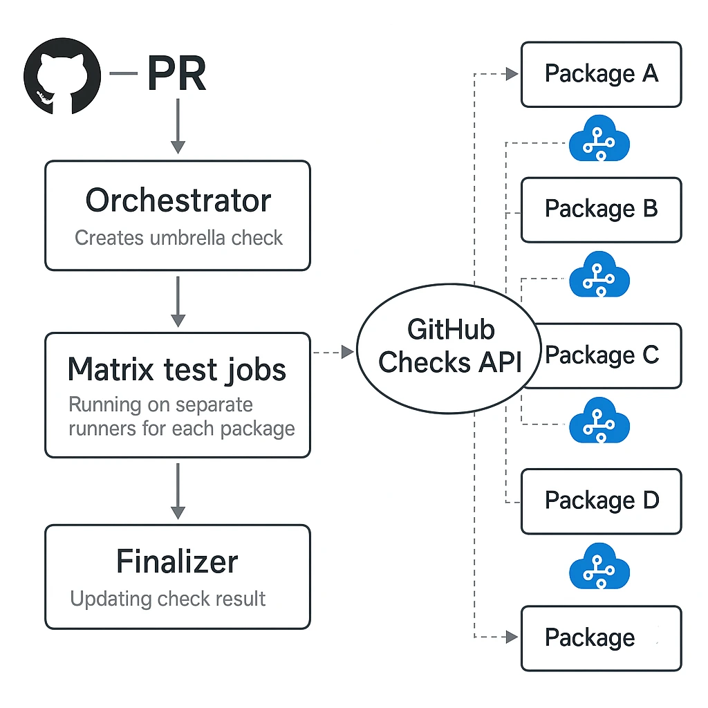

# GitHub Actions Test Orchestrator

This repository demonstrates a concept for orchestrating test execution in large monorepos using GitHub Actions. It shows how to:

1. Split test execution across multiple runners
2. Report progress back to a single GitHub Check
3. Maintain a clean PR/Merge Queue interface

## Architecture

The architecture is simple and to the point



The diagram above illustrates how the test orchestration works:

- A single GitHub Check is created for the PR
- Test suites are distributed across multiple runners
- Each runner reports progress back to the main check in real time
- Results are aggregated into a single check line

## Getting Started

1. Clone the repository
2. Install dependencies:

   ```bash
   yarn install
   ```

3. Run tests:

   ```bash
   yarn test
   ```

4. Make a commit, and see the workflow in action

## Contributing

Feel free to open issues and pull requests to improve this concept.

## License

[MIT](./LICENSE) license
